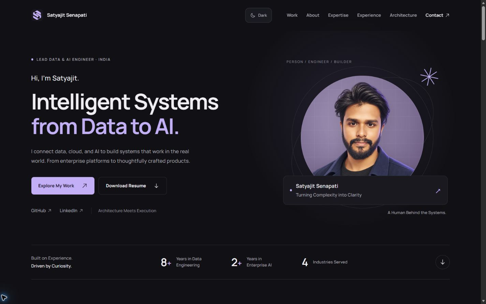

<p align="center">
  
</p>

<h1 align="center">Satyajit Senapati</h1>

<p align="center">
  <strong>Intelligent Systems from Data to AI.</strong><br>
  Enterprise depth, a product builder’s perspective, and a human behind the systems.
</p>

<p align="center">
  
  
  
  
</p>

<p align="center">
  <a href="#overview">Overview</a> ·
  <a href="#run-locally">Run Locally</a> ·
  <a href="#validation">Validation</a> ·
  <a href="#architecture">Architecture</a> ·
  <a href="#deployment">Deployment</a> ·
  <a href="#content">Content</a>
</p>

---

## Overview

An original portfolio in ink, lilac, and warm ivory. A custom digital avatar and **Woven Initials** identity introduce the person; real product previews, a career timeline, and interactive reference patterns show the work. The light theme is designed with the same care as the dark theme.

<p align="center"></p>

**[Explore the Portfolio](https://satyajit-senapati.github.io/Portfolio/)** · **[Download the Resume](./public/Satyajit-Senapati-Resume.pdf)** · **[Design Research](./docs/design-research.md)**

| Area                           | What it shows                                                                                                                                                |
| ------------------------------ | ------------------------------------------------------------------------------------------------------------------------------------------------------------ |
| **Identity**                   | A recognizable illustrated avatar, original vector logo, and clear Data & AI positioning                                                                     |
| **Expertise**                  | Domain-based skills across data engineering, Azure, AI/search, and software delivery                                                                         |
| **Experience**                 | A compact career timeline with expandable contributions and technologies                                                                                     |
| **Architecture Lab**           | Selectable cloud data platform, RAG, and production delivery patterns                                                                                        |
| **Live Applications**          | [DataRevia](https://datarevia.sattylabs.workers.dev/) and [NEVRI](https://nevri-notes.web.app/) with links to their websites                                 |
| **Local Engineering Projects** | [Orqalis](https://github.com/Satyajit-Senapati/Orqalis) and [PracticeLab](https://github.com/Satyajit-Senapati/PracticeLab) with links to their repositories |
| **Contact**                    | Email, [GitHub](https://github.com/Satyajit-Senapati), and [LinkedIn](https://www.linkedin.com/in/satyajit-senapati-007/)                                    |

The site is static at runtime. Fonts, illustrations, screenshots, and the resume are hosted locally. It needs no backend, API key, analytics service, or live GitHub API request. DataRevia is the renamed InterviewOS project; the portfolio uses its current name and URL.

## Run Locally

### Requirements

- Node.js **24** recommended
- npm

### Start the Site

```powershell
npm.cmd ci
npm.cmd run dev
```

Open [http://localhost:4000/](http://localhost:4000/). On macOS or Linux, use `npm` in place of `npm.cmd`.

## Validation

### Reusable UI/UX Skills

The repository includes a [portable frontend skill collection](skills/frontend/README.md) with separate art direction, UX, optional Google Stitch planning, implementation, motion, accessibility, responsive, design-system, performance, and visual-review skills. `AGENTS.md` routes tasks to the relevant specialists; `.agents/skills/` provides native Codex discovery. See the collection guide for direct invocation and copy-only reuse in other repositories.

Validate the collection with `npm run check:skills`. Upstream versions, licenses, and the assessment of `frontend-design-complete` are recorded in [source notes](skills/frontend/SOURCES.md).

### Site Checks

Run the project gate before a release:

```powershell
npm.cmd run validate
```

This runs ESLint, strict TypeScript compilation, a Vite production build, and checks for literal internal targets and missing published assets, including the avatar, project previews, font, and logo. The output is written to `dist/`.

Before release, also check the rendered page at 320, 390, 768, 1024, and 1440 px in both themes. Use the keyboard to open the mobile menu and traverse its links; verify Escape restores focus. Check all three top links from lower sections, theme persistence, disclosures, architecture controls, and email-copy feedback. Source checks do not replace browser interaction testing.

To inspect the production build locally:

```powershell
npm.cmd run preview
```

## Architecture

| Area          | Implementation                                                                                     |
| ------------- | -------------------------------------------------------------------------------------------------- |
| Application   | React 19, strict TypeScript, and Vite                                                              |
| Content       | Typed, version-controlled records in `src/content/portfolio.ts`                                    |
| Presentation  | Semantic components in `src/App.tsx` and CSS design tokens in `src/styles.css`                     |
| Interactions  | Native disclosure for experience/projects, selectable architecture stages, mobile menu, email copy |
| Appearance    | Site-controlled dark and light themes; dark by default, preference saved locally                   |
| Accessibility | Skip link, visible focus, semantic sections, keyboard controls, and reduced-motion support         |
| Metadata      | Open Graph card, Twitter card, Person structured data, canonical URL, sitemap, and robots file     |

The Architecture Lab diagrams are **reference patterns**, not public diagrams of a client's private infrastructure. See [architecture and design notes](docs/architecture.md) for the visual system and responsive strategy.

## Deployment

The [GitHub Actions workflow](.github/workflows/deploy.yml) publishes `dist/` to GitHub Pages after a push to `main`:

```text
push to main → npm ci → lint → TypeScript + Vite build → site checks → Pages metadata → deploy
```

1. Push this directory to the [Portfolio repository](https://github.com/Satyajit-Senapati/Portfolio) on `main`.
2. In **Settings → Pages**, select **GitHub Actions** as the build and deployment source.
3. Open the workflow run to find the deployed URL after it succeeds.

Vite uses a relative asset base, so the build works at a project Pages path or a user Pages root. The deployment step writes the correct absolute social image, canonical, sitemap, and robots URLs for the repository. If the site later uses a custom domain, set the repository variable `SITE_URL` to its final HTTPS URL and redeploy. The site has one route, so anchors and page refreshes need no routing fallback.

## Content

| Change                                                             | File                                     |
| ------------------------------------------------------------------ | ---------------------------------------- |
| Experience, skills, projects, architecture patterns, contact links | `src/content/portfolio.ts`               |
| Section structure and interactions                                 | `src/App.tsx`                            |
| Themes, layout, and responsive rules                               | `src/styles.css`                         |
| Browser metadata and structured data                               | `index.html`                             |
| Downloadable resume                                                | `public/Satyajit-Senapati-Resume.pdf`    |
| Social preview artwork and editable source                         | `public/og.png`, `scripts/social-card.html` |
| Digital avatar and product previews                                | `public/images/`                         |
| Vector identity and browser icon                                   | `public/brand/` and `public/favicon.svg` |
| Self-hosted typography and license                                 | `public/fonts/`                          |

The resume lives in `public/Satyajit-Senapati-Resume.pdf` and is linked for download in the hero and footer, with a view link in Experience. It includes contact information. DataRevia and NEVRI link to their live apps; Orqalis and PracticeLab link to their public repositories.

The social card is a 1200 × 630 PNG composed from the original avatar, logo, and local Manrope font. With the dev server running, open [the card source](http://localhost:4000/scripts/social-card.html) and click the image to download a regenerated `og.png`. Replace `public/og.png` with that file; site validation checks its dimensions against the Open Graph metadata.

## Project Structure

```text
src/
  App.tsx                  page sections and interactions
  content/portfolio.ts     typed portfolio content
  styles.css               design tokens, themes, and responsive layout
public/
  favicon.svg              Woven Initials variant optimized for small sizes
  brand/                   original tile, standalone, and monochrome marks
  fonts/                   Manrope variable font and OFL license
  images/                  generated avatar and real product previews
  og.png                   social preview card
  Satyajit-Senapati-Resume.pdf
scripts/prepare-pages.mjs  deployment metadata generation
.github/workflows/deploy.yml
docs/architecture.md
docs/design-research.md
docs/portfolio-preview.jpg  desktop hero shown in this README
```
